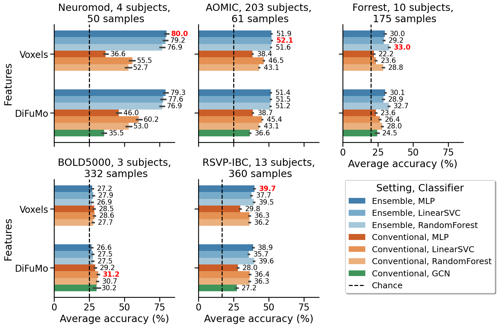

# Ensemble Learning and Decoding

## Preparing your data

All the scripts expect event-wise GLM effect size maps in the `data` directory. The data structure should be as follows:

```bash
data/neuromod
└── 3mm
    ├── sub-01.nii.gz
    ├── sub-01_labels.csv
    ├── sub-01_runs.csv
    ├── sub-02.nii.gz
    ├── sub-02_labels.csv
    ├── sub-02_runs.csv
    ├── sub-03.nii.gz
    ├── sub-03_labels.csv
    ├── sub-03_runs.csv
    ├── sub-05.nii.gz
    ├── sub-05_labels.csv
    └── sub-05_runs.csv
```

1. Under `data`, you need to create a sub-directory with the name of your dataset e.g. `neuromod` in this case.

2. This sub-directory should contain another sub-directory with the name of the resolution of the data e.g. `3mm` in this case. Note that we downsampled all our data to 3mm resolution because it is computationally expensive to work with the full resolution data.

3. The `3mm` directory should contain the effect size maps for each subject. The effect size maps should be in the NIfTI format. The filenames should be in the format `<subject_id>.nii.gz` e.g. `sub-01.nii.gz` in this case. Each volume in this nifti file should correspond to an event in the task. All runs should be concatenated in this one nifti file.

4. The `3mm` directory should also contain the labels for each subject. The labels should be in a CSV file. The filenames should be in the format `<subject_id>_labels.csv` e.g. `sub-01_labels.csv` in this case. The CSV file should have one column without any header. The column should contain the labels for each event/volume in nifti file.

### Computing event-wise GLM effect size maps

If you need a tutorial on how to get event-wise GLM effect size maps, you can follow [this tutorial](https://nilearn.github.io/stable/auto_examples/07_advanced/plot_beta_series.html#define-the-lss-models). Note that the method to compute event-wise GLM effect size maps is referred to as Least Squares Separation (LSS) in the tutorial.

We did the same for the AOMIC dataset using the `scripts/glm/glm_anticipation.py` script. So once you have downloaded the AOMIC dataset from [here](https://openneuro.org/datasets/ds002785/versions/2.0.0) you can update the paths in the script and run it to get the event-wise GLM effect size maps. Note that you only need the files with the `*task-anticipation*` wildcard in the filename from the AOMIC dataset.

## Reproduce the results in the paper

### Clone the repository

```bash
git clone git@github.com:man-shu/ensemble-fmri.git
```

### Download the data

Download downsampled 3mm event-wise GLM effect-size maps of fMRI datasets. It is only ~7GB in size. Yes it is indeed _small_

```bash
cd ensemble-fmri
wget https://zenodo.org/records/12204275/files/data.zip
unzip data.zip -d data
```

### Install the dependencies

Create a new conda environment with the dependencies.

```bash
conda env create -f env/main.yml
conda activate ensemble_nogpu
```

#### Optional dependencies

##### For calculating feature importance scores

We used a conditional permutation importance method to calculate the importance scores as provided in [this package](https://github.com/achamma723/Variable_Importance) and explained in [this paper](https://papers.nips.cc/paper_files/paper/2023/hash/d60e14c19cd6e0fc38556ad29ac8fbc9-Abstract-Conference.html). I have modified the code to work with the ensemble setting. To install the package, run:

```bash
git clone git@github.com:man-shu/Variable_Importance.git
cd Variable_Importance/BBI_package
pip install .
cd ../..
```

##### For comparison with the Graph Convolutional Network (GCN)

install the `torch` and `torch-geometric` packages:

```bash
pip install torch torch-geometric
```

### Run the experiments

To generate numbers plotted in Fig 2 and Fig 3 (over varying training sizes) in the paper:

* using the data in the `data` directory, saving the results in the `results` directory, with 20 parallel jobs, and DiFuMo features, run:

    ```bash
    python scripts/vary_train_size.py data results 20 difumo
    ```

* or with full-voxel space features, run:

    ```bash
    python scripts/vary_train_size.py data results 20 voxels
    ```

To generate numbers plotted in Fig 4 (over varying numbers of subjects in the ensemble) in the paper:

* using the data in the `data` directory, saving the results in the `results` directory, with 20 parallel jobs, and DiFuMo features, run:

    ```bash
    python scripts/vary_n_subs.py data results 20 difumo
    ```

* or with full-voxel space features, run:

    ```bash
    python scripts/vary_n_subs.py data results 20 voxels
    ```

#### Optional experiments

##### Feature importance scores

For computing the importance scores for the ensemble setting using the DiFuMo features and RandomForest classifier, plotted in Supplementary Fig. 2 in the paper:

```bash
python scripts/feat_imp.py data results 20
```

##### Pretraining L1 penalized Linear SVC

To use the pretraining strategy with L1 penalized Linear SVC (the results plotted in Supplementary Figure 2), you can change line 175 under the `pretrain` function in `utils.py` from:

```python
clf = LinearSVC(dual="auto")
```

to:

```python
clf = LinearSVC(dual="auto", penalty="l1")
```

##### Comparison with GCN

For comparing the ensemble approach with the GCN approach, run:

```bash
python scripts/compare_with_gcn.py data results 20 gcn/param_grid.json
```

### Plot the results

To plot Figures 2 and 3 in the paper, run:

```bash
python scripts/plotting/plot_fig2_fig3.py
```


![Figure 3: Gain in decoding accuracy when varying the number of training samples per class: Each plot represents a different dataset (along columns). The y-axis shows the average percent gain in decoding accuracy (accuracy of ensemble - accuracy of conventional) across all subjects and 20 cross-validation splits. On the x-axis, training size is reported as the number of samples per class in each cross-validation split. The confidence intervals represent a 95% confidence interval of bootstrap distribution. The horizontal line represents no average gain in accuracy and the vertical line, 10 samples per class.](plots/fig3.png "Gain in decoding accuracy when varying the number of training samples per class")

To plot Figure 4 in the paper, run:

```bash
python scripts/plotting/plot_fig4.py
```

![Figure 4: Gain in decoding accuracy over a varying number of subjects in the ensemble: Each plot represents a different dataset (along columns). The x-axis represents the number of subjects used in the ensemble method. The y-axis represents the average percent gain in decoding accuracy (accuracy of ensemble - accuracy of conventional) across all training sizes and 5 cross-validation splits. The confidence intervals represent a 95% interval of bootstrap distribution. The horizontal line represents no average gain in accuracy and the vertical line at 10 subjects in the ensemble.](plots/fig4.png "Gain in decoding accuracy over a varying number of subjects in the ensemble")

To plot the feature importance scores, run the following command. This will plot feature importance scores on surfaces and glass brains for each subject in each dataset. The plots will be saved in the `plots/feat_imp` directory.

```bash
python scripts/plotting/plot_suppfig1.py
```

One example is this:


To plot the comparison with GCN, run the following command. This will create similar plots as in Fig 2 but with the GCN results.

```bash
python scripts/plotting/plot_gcn.py
```



## Time taken

We ran the experiments on a CPU-based cluster with 72 nodes and 376 GB of RAM, but only used 20 parallel jobs. The OS was Ubuntu 18.04.6 LTS.

The time taken for each experiment is as follows:

```bash
# command
time python scripts/vary_train_size.py data results 20 difumo  

# output
264026.23s user 4271.26s system 1606% cpu 4:38:23.80 total
```

```bash
# command
time python scripts/vary_train_size.py data results 20 voxels  

# output
541518.33s user 20061.83s system 1715% cpu 9:05:44.40 total
```

```bash
# command
time python scripts/vary_n_subs.py data results 20 difumo 

# output
264768.95s user 644.23s system 1804% cpu 4:05:10.79 total
```

```bash
# command
time python scripts/vary_n_subs.py data results 20 voxels 

# output
361548.14s user 5086.45s system 1828% cpu 5:34:16.29 total
```

```bash
# command
time python scripts/feat_imp.py data results 20  

# output
2596918.56s user 65902.53s system 2082% cpu 35:31:34.59 total
```

## More details

### Install conda

If you don't have conda installed, you can install it from [here](https://docs.conda.io/en/latest/miniconda.html).
