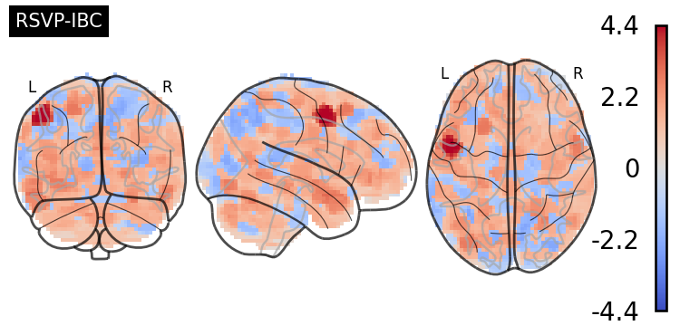

# Ensemble Learning and Decoding

## How to run

### Clone the repository

```bash
git clone git@github.com:man-shu/ensemble-fmri.git
```

### Download the data

Download downsampled 3mm event-wise GLM effect-size maps of fMRI datasets. It is only ~7GB in size. Yes it is indeed _small_

```bash
cd ensemble-fmri
wget https://zenodo.org/records/12204275/files/data.zip
unzip data.zip -d data
```

### Install the dependencies

Create a new conda environment with the dependencies.

```bash
conda env create -f env/main.yml
conda activate ensemble_nogpu
```

### Run the experiments

To generate numbers plotted in Fig 2 and Fig 3 (over varying training sizes) in the paper:

* using the data in the `data` directory, saving the results in the `results` directory, with 20 parallel jobs, and DiFuMo features, run:

    ```bash
    python scripts/vary_train_size.py data results 20 difumo
    ```

* or with full-voxel space features, run:

    ```bash
    python scripts/vary_train_size.py data results 20 voxels
    ```

To generate numbers plotted in Fig 4 (over varying numbers of subjects in the ensemble) in the paper:

* using the data in the `data` directory, saving the results in the `results` directory, with 20 parallel jobs, and DiFuMo features, run:

    ```bash
    python scripts/vary_n_subs.py data results 20 difumo
    ```

* or with full-voxel space features, run:

    ```bash
    python scripts/vary_n_subs.py data results 20 voxels
    ```

## Time taken

We ran the experiments on a CPU-based cluster with 72 nodes and 376 GB of RAM.

The time taken for each experiment is as follows:

```bash
# command
time python scripts/vary_train_size.py data results 20 difumo  

# output
264026.23s user 4271.26s system 1606% cpu 4:38:23.80 total
```

```bash
# command
time python scripts/vary_train_size.py data results 20 voxels  

# output
541518.33s user 20061.83s system 1715% cpu 9:05:44.40 total
```


## Abstract

Decoding cognitive states from functional magnetic resonance imaging is central to understanding the functional organization of the brain. Within-subject decoding avoids between-subject correspondence problems but requires large sample sizes to make accurate predictions; obtaining such large sample sizes is both challenging and expensive. Here, we investigate an ensemble approach to decoding that combines the classifiers trained on data from other subjects to decode cognitive states in a new subject. We compare it with the conventional decoding approach on five different datasets and cognitive tasks. We find that it outperforms the conventional approach by up to 20\% in accuracy, especially for datasets with limited per-subject data. The ensemble approach is particularly advantageous when the classifier is trained in voxel space. Furthermore, a Multi-layer Perceptron turns out to be a good default choice as an ensemble method. These results show that the pre-training strategy reduces the need for large per-subject data.

## Results

### The ensemble approach outperforms conventional decoding


### It is beneficial in scarce data scenarios

![Gain in decoding accuracy when varying the number of training samples per class: Each plot represents a different dataset (along columns). The y-axis shows the average percent gain in decoding accuracy (accuracy of ensemble - accuracy of conventional) across all subjects and 20 cross-validation splits. On the x-axis, training size is reported as the number of samples per class in each cross-validation split. The confidence intervals represent a 95% confidence interval of bootstrap distribution. The horizontal line represents no average gain in accuracy and the vertical line, 10 samples per class.](plots/gains_v_samples_per_class_balanced_accuracy.png "Gain in decoding accuracy when varying the number of training samples per class")

### The gains increase with increasing number of subjects in the ensemble

![Gain in decoding accuracy over a varying number of subjects in the ensemble: Each plot represents a different dataset (along columns). The x-axis represents the number of subjects used in the ensemble method. The y-axis represents the average percent gain in decoding accuracy (accuracy of ensemble - accuracy of conventional) across all training sizes and 5 cross-validation splits. The confidence intervals represent a 95% interval of bootstrap distribution. The horizontal line represents no average gain in accuracy and the vertical line at 10 subjects in the ensemble.](plots/varysubs_vs_gain.png "Gain in decoding accuracy over a varying number of subjects in the ensemble")

### Extracting voxel-wise feature importance scores is still possible



## More details

### Install conda

If you don't have conda installed, you can install it from [here](https://docs.conda.io/en/latest/miniconda.html).
